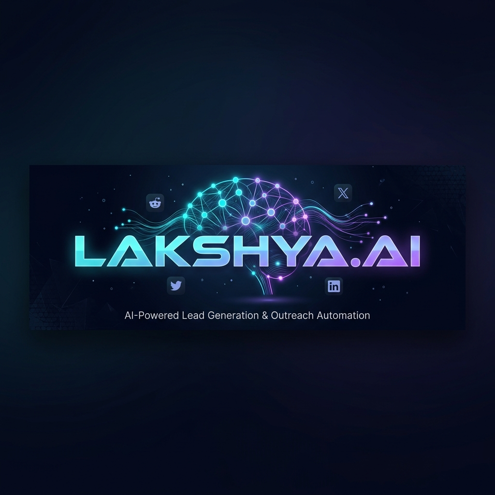
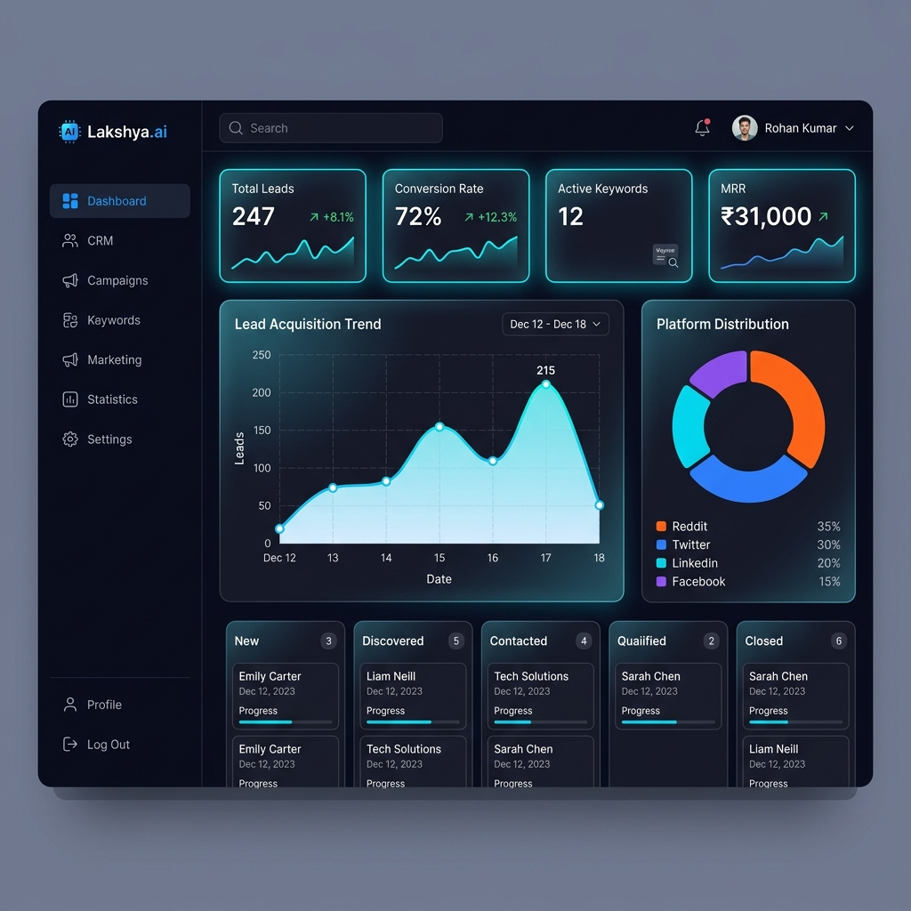
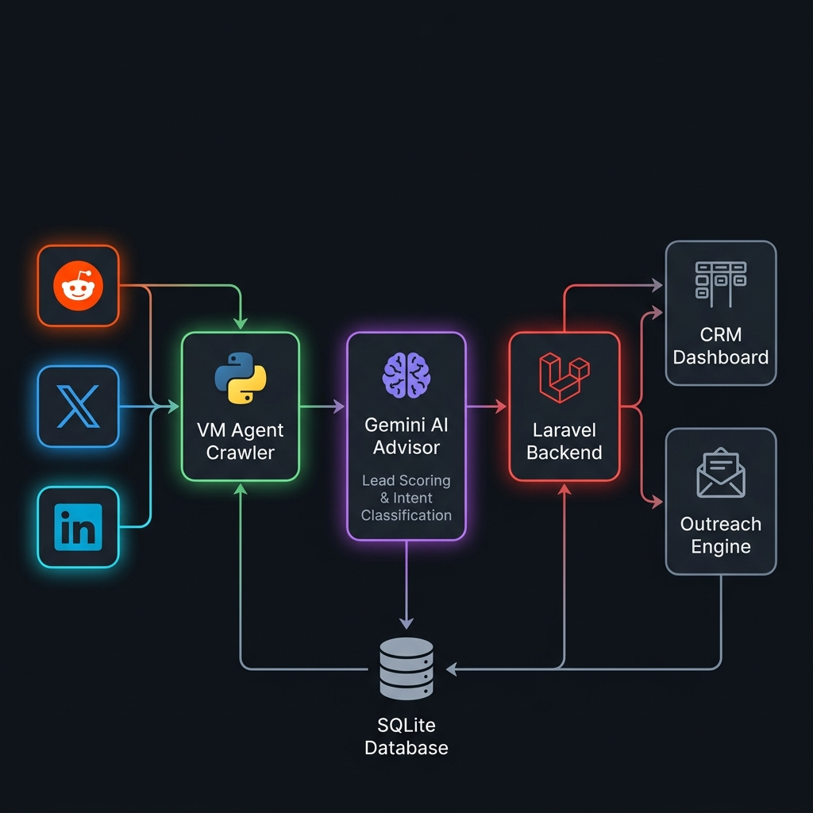

<p align="center">
  
</p>

<h1 align="center">🎯 Lakshya.ai</h1>
<h3 align="center"><em>AI-Powered Lead Generation & Outreach Automation Platform</em></h3>

<p align="center">
  
  
  
  
  
  
  
  
</p>

<p align="center">
  <strong>Scrape → Qualify → Pitch → Convert</strong><br/>
  <sub>Turn social media conversations into qualified B2B leads — automatically.</sub>
</p>

---

## 🧰 Tech Stack

<p align="center">
  
  
  
  
  
  
  
</p>

<p align="center">
  
  
  
  
  
  
  
</p>

<p align="center">
  
  
  
  
  
  
</p>

---

## 📋 Table of Contents

- [🧰 Tech Stack](#-tech-stack)
- [✨ Overview](#-overview)
- [🖥️ Dashboard Preview](#️-dashboard-preview)
- [🏗️ Architecture](#️-architecture)
- [🚀 Key Features](#-key-features)
- [📁 Project Structure](#-project-structure)
- [⚡ Quick Start](#-quick-start)
- [⚙️ Configuration](#️-configuration)
- [🤖 VM Agent Crawler](#-vm-agent-crawler)
- [📊 SaaS Economics](#-saas-economics)
- [🛣️ Roadmap](#️-roadmap)
- [📈 GitHub Stats](#-github-stats)
- [🌐 Socials](#-socials)
- [🤝 Contributing](#-contributing)
- [📄 License](#-license)

---

## ✨ Overview

**Lakshya.ai** is a state-of-the-art AI-driven B2B lead generation and outreach automation platform. It autonomously monitors social platforms — **Reddit**, **Twitter/X**, and **LinkedIn** — for active discussions matching your target keywords, qualifies intent scores using **Gemini AI** reasoning, and drafts personalized outreach pitches to maximize customer conversions.

> 💡 **The Problem:** Manually scouring social platforms for potential leads is slow, inconsistent, and doesn't scale.
>
> 🎯 **The Solution:** Lakshya automates the entire pipeline — from discovery to qualification to personalized outreach — using AI at every step.

### 🔥 What Makes Lakshya Different?

| Traditional Lead Gen | Lakshya.ai |
|---|---|
| ❌ Manual platform browsing | ✅ Automated multi-platform crawling |
| ❌ Gut-feel lead scoring | ✅ AI-powered intent classification (0-100) |
| ❌ Generic cold outreach | ✅ Context-aware personalized pitches |
| ❌ Spreadsheet CRM | ✅ Visual Kanban pipeline management |
| ❌ No analytics | ✅ Real-time economics & P&L dashboard |

---

## 🖥️ Dashboard Preview

<p align="center">
  
</p>

<p align="center"><em>Real-time analytics dashboard with lead trends, platform distribution, and CRM metrics</em></p>

---

## 🏗️ Architecture

<p align="center">
  
</p>

### How It Works

```
  ┌─────────────┐     ┌─────────────┐     ┌─────────────┐
  │   Reddit    │     │  Twitter/X  │     │  LinkedIn   │
  │   (API/RSS) │     │  (DDG Index)│     │  (DDG Index)│
  └──────┬──────┘     └──────┬──────┘     └──────┬──────┘
         │                   │                   │
         └───────────┬───────┴───────────────────┘
                     │
              ┌──────▼──────┐
              │  VM Agent   │  ← Python Background Daemon
              │  Crawler    │
              └──────┬──────┘
                     │
              ┌──────▼──────┐
              │  Gemini AI  │  ← Intent Scoring (0-100)
              │  Advisor    │  ← Category Classification
              └──────┬──────┘  ← Personalized Reply Draft
                     │
              ┌──────▼──────┐
              │   Laravel   │  ← CRM, Kanban, Analytics
              │   Backend   │  ← Client Management
              └──────┬──────┘  ← Billing & Quotas
                     │
              ┌──────▼──────┐
              │   SQLite    │
              │   Database  │
              └─────────────┘
```

---

## 🚀 Key Features

### 🧠 AI Lead Qualification
Leverages the **Google Gemini API** (`gemini-2.5-flash`) to analyze sales intent with a proprietary scoring system:
- **Score Range:** 0-100 intent score per lead
- **Intent Categories:** High Intent, Medium Intent, Low Intent
- **Smart Fallback:** Heuristic NLP classifier when API is unavailable
- **Threshold Filtering:** Only leads scoring ≥70 are promoted to CRM

### 📨 Outreach Automation
Generates tailored, context-aware response drafts that reference the original post:
- Platform-native tone matching (casual for Reddit, professional for LinkedIn)
- Automatic CTA injection with project-specific links
- One-click send or manual review workflow

### 📋 CRM Kanban Board
Intuitively manage leads across pipeline stages:

```
  New → Discovered → Contacted → Qualified → Closed
  ──────────────────────────────────────────────────►
```

- Drag-and-drop status transitions
- Conversation history tracking
- Meeting scheduling integration
- AI-generated reply management

### 🔑 Campaign & Keyword Management
- Create and manage multiple **Projects** (isolated lead pipelines)
- Define targeting **Keywords** per project
- Toggle keywords active/inactive for crawl control
- Platform account management for authenticated scraping

### 🤖 Background Crawler Service
Autonomous Python daemon (`vm_agent/`) that runs 24/7:
- Periodic multi-platform scraping every 30 seconds
- Reddit OAuth API → RSS fallback → Simulation fallback
- DuckDuckGo index search for Twitter/X and LinkedIn
- Rate-limit aware with configurable delays

### 📊 SaaS Economics Dashboard
Real-time financial analytics for B2B SaaS monitoring:
- **MRR / ARR** tracking with tier breakdown (Starter ₹1,499 / Pro ₹4,999)
- **OPEX** breakdown (VMs, hosting, AI API, salaries, ad spend)
- **Net Profit / Loss** calculation with historical trends
- **Advanced Metrics:** CAC, LTV, ARPU, LTV:CAC ratio, burn rate, runway

### 🎨 AI Marketing Generator
Built-in creative content generator powered by Gemini AI:
- Auto-generate marketing posts for social platforms
- Campaign launch workflow with asset generation
- Client-facing marketing portal

### 👥 Multi-Tenant Client Management
- Admin + Client role separation
- Client impersonation for support workflows
- Per-client subscription and quota management
- Isolated campaign dashboards per client

---

## 📁 Project Structure

```
lakshya.ai/
├── 📂 app/
│   ├── Http/
│   │   ├── Controllers/
│   │   │   ├── DashboardController.php    # Analytics & VM status
│   │   │   ├── LeadController.php         # CRM & lead management
│   │   │   ├── CampaignController.php     # Keywords, projects, billing
│   │   │   └── ClientController.php       # Client portal & impersonation
│   │   └── Traits/
│   │       └── ActiveProjectTrait.php     # Multi-project session handling
│   └── Models/
│       ├── Lead.php                       # Lead pipeline entity
│       ├── Post.php                       # Scraped social media posts
│       ├── Project.php                    # Campaign project container
│       ├── Keyword.php                    # Tracking keywords
│       ├── PlatformAccount.php            # Social platform credentials
│       ├── Subscription.php               # Billing tiers & quotas
│       ├── User.php                       # Admin/Client users
│       ├── Conversation.php               # Lead conversation threads
│       ├── Meeting.php                    # Scheduled meetings
│       ├── Invoice.php                    # Billing invoices
│       ├── Notification.php               # System notifications
│       ├── AuditLog.php                   # Action audit trail
│       └── AgentMemory.php                # AI context memory
│
├── 📂 resources/views/
│   ├── admin/                             # Admin panel views
│   │   ├── dashboard.blade.php            # Main analytics dashboard
│   │   ├── crm.blade.php                  # CRM Kanban board
│   │   ├── marketing.blade.php            # AI content generator
│   │   ├── statistics.blade.php           # SaaS economics
│   │   ├── keywords.blade.php             # Keyword management
│   │   ├── projects.blade.php             # Project CRUD
│   │   ├── clients.blade.php              # Client directory
│   │   ├── billing.blade.php              # Billing & invoices
│   │   └── settings.blade.php             # Account settings
│   ├── clients/                           # Client portal views
│   │   ├── dashboard.blade.php            # Client analytics
│   │   └── marketing.blade.php            # Client campaign builder
│   └── layouts/                           # Blade layout templates
│
├── 📂 vm_agent/                           # 🤖 Python Crawler Service
│   ├── runner.py                          # Main daemon loop & orchestrator
│   ├── scraper.py                         # Multi-platform scraping engine
│   ├── advisor.py                         # Gemini AI lead qualifier
│   ├── worker.py                          # Background task worker
│   ├── automation.py                      # Workflow automation scripts
│   ├── db.py                              # Database connector (SQLite)
│   ├── api.py                             # Flask REST API server
│   ├── config.py                          # Environment configuration
│   └── requirements.txt                   # Python dependencies
│
├── 📂 database/
│   ├── migrations/                        # Schema definitions
│   └── database.sqlite                    # Application database
│
├── 📂 routes/
│   └── web.php                            # All route definitions
│
├── 📂 docs/                               # Documentation & assets
├── 📂 config/                             # Laravel configuration
├── 📂 public/                             # Static assets (CSS/JS)
├── composer.json                          # PHP dependencies
├── package.json                           # Frontend dependencies
├── vite.config.js                         # Vite bundler config
└── .env.example                           # Environment template
```

---

## ⚡ Quick Start

### Prerequisites

| Requirement | Version | Purpose |
|---|---|---|
| PHP | 8.2+ | Laravel backend |
| Composer | Latest | PHP dependency manager |
| Node.js | 18+ | Frontend build tooling |
| Python | 3.10+ | VM Agent crawler service |
| SQLite | 3.x | Application database |

### 1️⃣ Clone the Repository

```bash
git clone https://github.com/yourusername/lakshya.ai.git
cd lakshya.ai
```

### 2️⃣ Install Dependencies

```bash
# PHP dependencies
composer install

# Frontend dependencies
npm install

# Python crawler dependencies
pip install -r vm_agent/requirements.txt
```

### 3️⃣ Environment Setup

```bash
cp .env.example .env
php artisan key:generate
```

Edit `.env` and configure your API keys:

```env
# Required for AI features
GEMINI_API_KEY=your_gemini_api_key_here

# Database (SQLite by default — zero config)
DB_CONNECTION=sqlite
```

### 4️⃣ Database Migration

```bash
php artisan migrate --seed
```

### 5️⃣ Start Development Server

```bash
# Option A: Start everything at once (recommended)
composer dev

# Option B: Start services individually
php artisan serve          # Laravel backend → http://localhost:8000
npm run dev                # Vite frontend assets
python vm_agent/runner.py  # Crawler daemon (separate terminal)
```

### 6️⃣ Access the Dashboard

🌐 Open your browser and navigate to:
```
http://localhost:8000/admin/dashboard
```

---

## ⚙️ Configuration

### Environment Variables

| Variable | Required | Description |
|---|---|---|
| `GEMINI_API_KEY` | ✅ Yes | Google Gemini API key for AI features |
| `DB_CONNECTION` | ✅ Yes | Database driver (`sqlite` by default) |
| `REDDIT_CLIENT_ID` | ⬜ Optional | Reddit API OAuth client ID |
| `REDDIT_CLIENT_SECRET` | ⬜ Optional | Reddit API OAuth client secret |
| `APP_URL` | ✅ Yes | Application base URL |
| `QUEUE_CONNECTION` | ✅ Yes | Queue driver (`database` recommended) |

### Gemini AI Setup

1. Visit [Google AI Studio](https://aistudio.google.com/)
2. Generate an API key
3. Add it to your `.env` file as `GEMINI_API_KEY`
4. The system uses `gemini-2.5-flash` for fast, cost-effective inference

> 📝 **Note:** Without a Gemini API key, the system falls back to a built-in heuristic NLP classifier for lead scoring. Core functionality is preserved.

---

## 🤖 VM Agent Crawler

The VM Agent is a Python-based background daemon that handles automated lead discovery.

### Scraping Pipeline

```
┌──────────────────────────────────────────────────────────┐
│                    SCRAPING PIPELINE                      │
├──────────┬──────────┬──────────────────────┬─────────────┤
│ Platform │ Method   │ Strategy             │ Fallback    │
├──────────┼──────────┼──────────────────────┼─────────────┤
│ Reddit   │ OAuth    │ Official API (v1)    │ RSS → Sim   │
│ Twitter  │ DDG      │ DuckDuckGo Indexing  │ Simulation  │
│ LinkedIn │ DDG      │ DuckDuckGo Indexing  │ Simulation  │
└──────────┴──────────┴──────────────────────┴─────────────┘
```

### Running the Crawler

```bash
# Continuous daemon mode (runs every 30 seconds)
python vm_agent/runner.py

# Single run mode (run once and exit)
python vm_agent/runner.py --single

# Trigger via Dashboard UI
# Click "Trigger VM Crawl" button on the admin dashboard
```

### API Endpoints (Flask)

| Endpoint | Method | Description |
|---|---|---|
| `/status` | GET | Health check & uptime stats |
| `/trigger` | POST | Trigger immediate crawl cycle |

---

## 📊 SaaS Economics

Lakshya includes a built-in SaaS economics dashboard tracking real P&L:

### Revenue Model

| Tier | Monthly Price | Features |
|---|---|---|
| 🆓 Free Trial | ₹0 | Limited leads, basic CRM |
| 🟢 Starter | ₹1,499/mo | Standard crawling, AI scoring |
| 🟣 Pro | ₹4,999/mo | Priority crawling, advanced analytics |

## 🛣️ Roadmap

### Completed Core Milestones
- [x] Multi-platform social scraping (Reddit, Twitter, LinkedIn)
- [x] Gemini AI lead qualification & intent scoring
- [x] CRM Kanban pipeline board & lead management
- [x] Background VM Agent crawler daemon
- [x] SaaS Economics & P&L analytics dashboard
- [x] AI marketing content generators (Social, Growth, and Ad suites)
- [x] Multi-tenant client directories and admin simulation impersonation mode
- [x] **AI Agents Portal** (Visitor tracking stream, WhatsApp templates, LinkedIn logs, Queue terminal consoles)

### Uncompleted Production-Ready Roadmap Tasks
- [ ] 🔐 **SMTP/OAuth Mail Warmup**: Implement real Gmail/Outlook APIs for secure automated outbound sequences.
- [ ] 💬 **Meta WhatsApp Business API Integration**: Configure official Meta gateway tokens and message template templates.
- [ ] 💼 **Production LinkedIn Outbox Session Manager**: Integrate cookie rotation or official LinkedIn API pipelines for automated messaging.
- [ ] ⚙️ **Process Daemon Manager**: Set up PM2 or Systemd service configuration for `agent_worker.py` daemon persistence in production.
- [ ] 🌐 **Production Database Migration**: Move from local SQLite to a robust MySQL or PostgreSQL server.
- [ ] 🔗 **Webhooks & Instant Slack/Discord Notifications** for new high-intent leads.
- [ ] 📱 **Mobile-responsive PWA** interface for on-the-go CRM updates.
- [ ] 🔒 **Full Auth Multi-Factor Authentication (MFA)** for client users.

---

## 📈 GitHub Stats

<p align="center">
  
  
</p>

<p align="center">
  
  
</p>

<p align="center">
  
</p>

<!-- GitHub Activity Graph -->
<p align="center">
  
</p>

---

## 🌐 Socials

<p align="center">
  <a href="https://github.com/punit-20"></a>
  <a href="https://www.linkedin.com/in/punit-soni-227467203?utm_source=share_via&utm_content=profile&utm_medium=member_android"></a>
  <a href="https://www.instagram.com/heispunit/"></a>
  <a href="mailto:punitsoni202@gmail.com"></a>
</p>

---

## 🤝 Contributing

We welcome contributions! Here's how to get started:

1. **Fork** the repository
2. **Create** a feature branch: `git checkout -b feature/amazing-feature`
3. **Commit** your changes: `git commit -m 'Add amazing feature'`
4. **Push** to the branch: `git push origin feature/amazing-feature`
5. **Open** a Pull Request

> ⚠️ Please ensure your code follows the existing coding standards and includes appropriate tests.

---

## 📄 License

This software is **proprietary and confidential**. All rights reserved.

Unauthorized copying, modification, distribution, or use of this software, via any medium, is strictly prohibited without express written permission.

---

<p align="center">
  
</p>

<p align="center">
  <sub>Powered by Laravel 12 · Gemini AI · Python · TailwindCSS</sub>
</p>

<p align="center">
  
  
</p>
